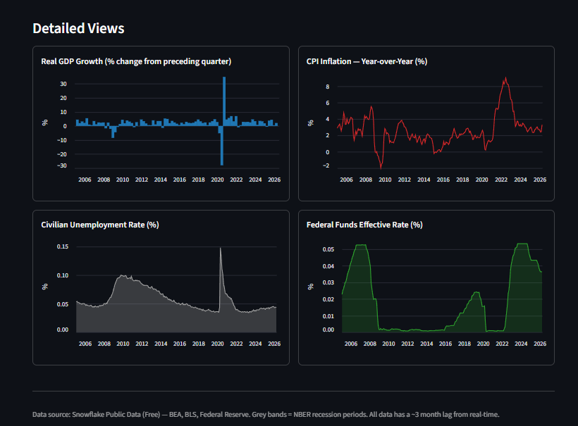

# The Economy in One Dashboard

A real-time U.S. macroeconomic dashboard built with **Streamlit in Snowflake**, sourcing live federal data via the **Snowflake Marketplace** with zero ETL.


<!-- Replace with your own screenshot or GIF -->
<!--  -->

## Overview

This dashboard visualizes four key U.S. economic indicators on a shared timeline, making it easy to see how they interact across economic cycles:

| Indicator | Source | Frequency |
|-----------|--------|-----------|
| Real GDP Growth (% change) | Bureau of Economic Analysis (BEA) | Quarterly |
| CPI Inflation (Year-over-Year %) | Bureau of Labor Statistics (BLS) | Monthly |
| Civilian Unemployment Rate | Bureau of Labor Statistics (BLS) | Monthly |
| Federal Funds Effective Rate | Federal Reserve | Monthly |

## Features

- **KPI cards** showing latest values with period-over-period deltas
- **Combined time-series chart** with all indicators overlaid
- **Detailed panel views** (bar, area, line charts) for each indicator
- **Interactive controls** — date range slider, indicator toggles
- **Cached queries** with manual refresh button for snappy interactions

## Architecture

```
┌─────────────────────────────────────────────────┐
│  Snowflake Marketplace                          │
│  └─ Snowflake Public Data (Free)                │
│     ├─ FINANCIAL_ECONOMIC_INDICATORS_TIMESERIES  │
│     └─ BUREAU_OF_LABOR_STATISTICS_PRICE_...      │
└────────────────────┬────────────────────────────┘
                     │ SQL queries (no ETL)
                     ▼
┌─────────────────────────────────────────────────┐
│  Streamlit in Snowflake (Container Runtime)     │
│  └─ streamlit_app.py                            │
│     ├─ @st.cache_data loaders                   │
│     ├─ YoY inflation calculation                │
│     └─ Interactive Streamlit UI                 │
└─────────────────────────────────────────────────┘
```

**Key design decisions:**
- Queries live data directly from Snowflake's shared data layer — no pipelines, no staging tables
- Computes CPI year-over-year inflation on the fly from the raw index
- Uses `@st.cache_data` with 1-hour TTL to balance freshness and performance

## Prerequisites

1. A [Snowflake account](https://signup.snowflake.com/) (free trial works)
2. Install the **[Snowflake Public Data (Free)](https://app.snowflake.com/marketplace/listing/GZTSZ290BV255)** listing from the Marketplace
3. A warehouse (the app uses `COMPUTE_WH` by default — edit `snowflake.yml` to change)

## Running the App

### In Snowflake (recommended)

1. Open **Snowsight → Workspaces**
2. Upload or clone this project into a Workspace folder
3. Open `streamlit_app.py`
4. Click **Run**

### Locally (for development)

```bash
# Create a .streamlit/secrets.toml with your Snowflake credentials:
# [connections.snowflake]
# account = "your-account"
# user = "your-user"
# password = "your-password"
# warehouse = "COMPUTE_WH"
# role = "your-role"

pip install streamlit snowflake-connector-python
streamlit run streamlit_app.py
```

## Project Structure

```
economy-dashboard/
├── .streamlit/config.toml   # Streamlit theme configuration
├── .gitignore
├── pyproject.toml            # Python dependencies
├── snowflake.yml             # Snowflake app deployment config
├── streamlit_app.py          # Main dashboard application
└── README.md
```

## Skills Demonstrated

- **Cloud data engineering** — querying live government datasets via Snowflake Marketplace data sharing (zero ETL)
- **Full-stack data application** — SQL, Python data transformation, and interactive UI in one project
- **Production patterns** — cache management, parameterized filtering, responsive layout
- **Domain knowledge** — joining datasets across different temporal granularities (quarterly GDP vs. monthly CPI/unemployment)

## Data Sources

All data comes from the [Snowflake Public Data (Free)](https://app.snowflake.com/marketplace/listing/GZTSZ290BV255) Marketplace listing, which aggregates 90+ public domain datasets including:

- **BEA** (Bureau of Economic Analysis) — GDP and national accounts
- **BLS** (Bureau of Labor Statistics) — Employment, prices, and inflation
- **Federal Reserve** — Interest rates, credit, and monetary policy data

## License

MIT
